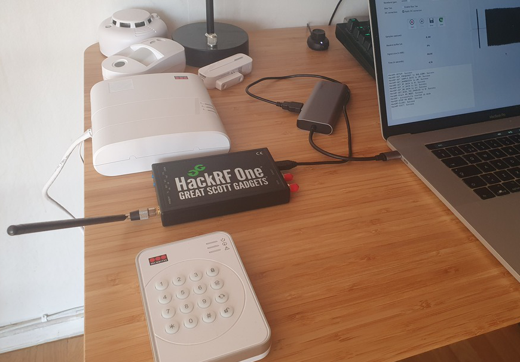

# My Master Thesis in Computer Security
This repository contains my master thesis. It was done within the field of Computer Security / Ethical Hacking. In the thesis, I examined the security of a home alarm system from the well-known Swedish security group Securitas. The work focused mainly on Radio-Frequency (RF) Hacking. A major replay-attack vulnerability was found in the proprietary RF protocol, which the devices of the system use to communicate with each other.

The final report can be found [**here**](https://www.diva-portal.org/smash/record.jsf?pid=diva2:1600180).

